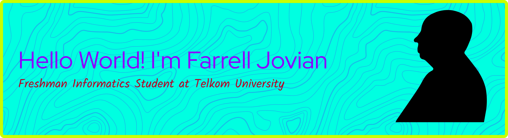

🌱 I’m currently learning AI
 

Skills

   

Connect with me 😄

<picture data-importer="pacman">
  <source media="(prefers-color-scheme: dark)" srcset="https://raw.githubusercontent.com/FJO0/FJO0/pacman-output/pacman-contribution-graph-dark.svg?game=pacman">
  <source media="(prefers-color-scheme: light)" srcset="https://raw.githubusercontent.com/FJO0/FJO0/pacman-output/pacman-contribution-graph.svg?game=pacman">
  
</picture>

⚡ Fun fact: Analyzing a film while      watching it makes me enjoy it more

